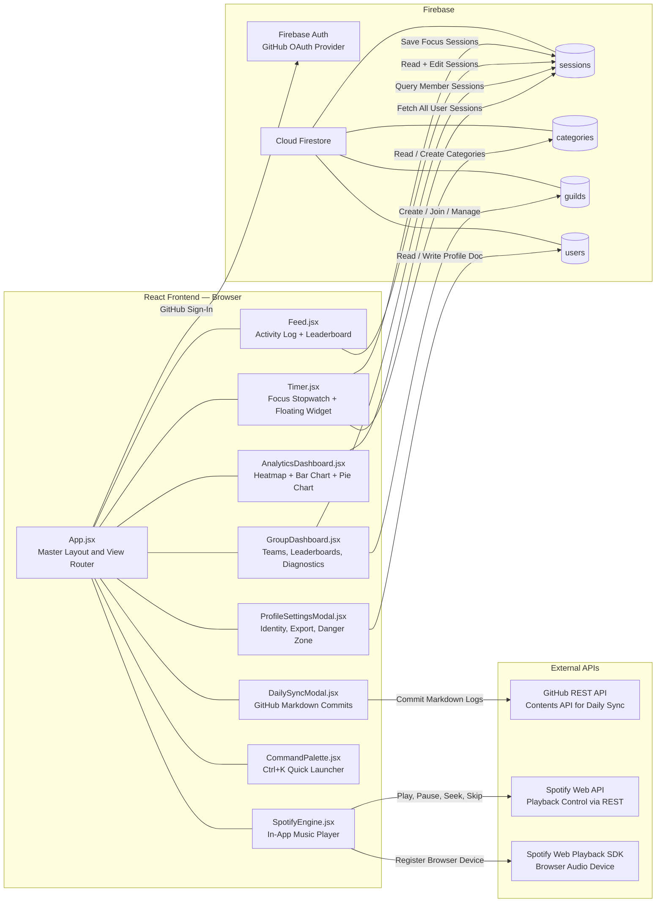
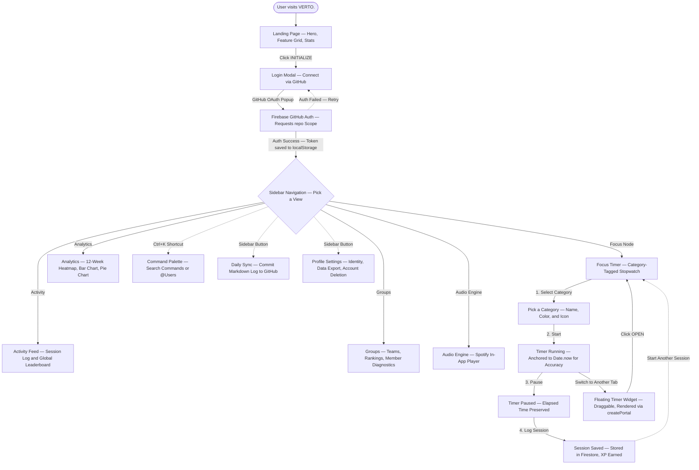
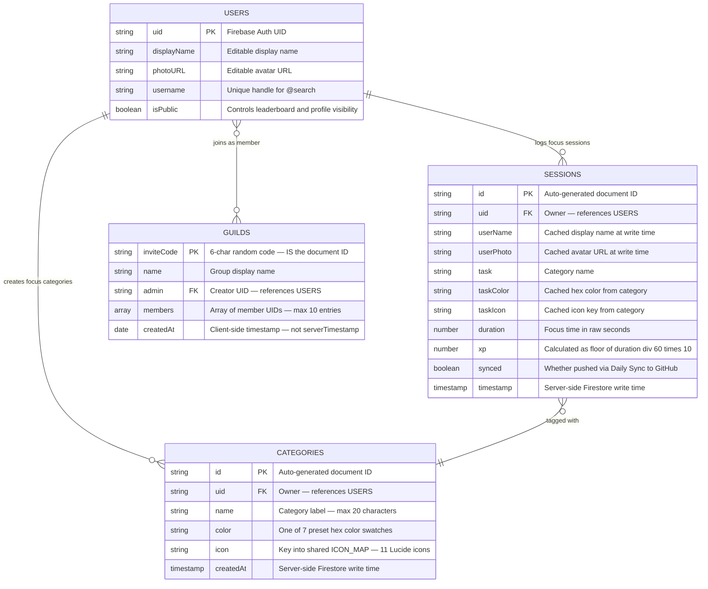

<div align="center">
  

  <br />
  <br />

  # **VERTO.**
  **Gamified Focus. Smart Analytics. Unbroken Flow.**

  <p align="center">
    
    
    
    
    
    
    
  </p>
</div>

<br />

> **🚀 Official Documentation:** [docs.uraj.dev/verto](https://docs.uraj.dev/verto) — Read deep dives into the audio engine, gamification mechanics, group telemetry, and firestore schemas that power VERTO.

---

## ✦ Table of Contents 🟩

1. [What is VERTO?](#what-is-verto)
2. [System Architecture](#system-architecture)
3. [User Flow](#user-flow)
4. [Core Features](#core-features)
5. [The XP & Leveling System](#the-xp--leveling-system)
6. [Spotify Integration](#spotify-integration)
7. [Database Schema](#database-schema)
8. [Project Structure](#project-structure)
9. [Component Breakdown](#component-breakdown)
10. [Environment Setup](#environment-setup)
11. [Installation & Running Locally](#installation--running-locally)
12. [How Things Work Under the Hood](#how-things-work-under-the-hood)
13. [Unused Code & Future Opportunities](#unused-code--future-opportunities)
14. [Security Considerations](#security-considerations)

---

## What is VERTO?

**VERTO.** is a gamified deep-work tracker built as a single-page React app. Instead of a plain Pomodoro timer, it wraps focus sessions into something more engaging — you pick a category, start a flexible stopwatch, earn XP for your time, and see where you stand against friends on leaderboards.

The core idea: **make focus sessions feel like progress, not a chore.**

Here's what it brings together:

- 🎯 **Focus Timer** — a flexible stopwatch (not a fixed countdown) with categories you define yourself.
- 🏆 **XP System** — every minute of focus earns 10 XP. Your total XP shows up on leaderboards.
- 👥 **Groups** — create or join small teams (up to 10 people) with private leaderboards and breakdowns of what everyone's working on.
- 📊 **Analytics** — a 12-week heatmap, weekly bar charts, and category distribution charts to visualize your habits.
- 🎵 **Spotify Player** — control your music without leaving the app.
- 📝 **GitHub Daily Sync** — automatically commit a markdown log of your day's sessions to a GitHub repo.
- 🔍 **Command Palette** — quick keyboard launcher (`Ctrl/Cmd + K`) to navigate anywhere or search for users.

The whole UI uses a consistent dark theme — near-black backgrounds (`#030712`), emerald green accents (`#10b981`), glassmorphic panels, and monospace-style labels throughout.

There's no custom backend server. Everything runs client-side — Firebase handles authentication and data storage, Spotify and GitHub APIs are called directly from the browser.

---

## System Architecture



**Key technology choices:**

| Layer | Technology | Why |
|---|---|---|
| **Frontend** | React 19, Vite 8 | Fast dev server, modern React features |
| **Styling** | Tailwind CSS v4 | Utility-first, all styling via inline classes with arbitrary values — no custom theme config |
| **Database** | Cloud Firestore | Real-time listeners for live data, simple NoSQL document model |
| **Auth** | Firebase Auth (GitHub provider) | One-click sign-in, gives us a GitHub token for the Daily Sync feature |
| **Charts** | Recharts | React-native charting for bar and pie charts |
| **Icons** | Lucide React | Clean, consistent icon set |
| **Music** | Spotify Web Playback SDK + REST API | Browser-based playback device with full transport control |

> [!NOTE]
> `react-router-dom` is listed in `package.json` but is **not actually used**. The app handles all view switching through React state (`currentView` in `App.jsx`), not URL-based routes.

---

## User Flow



---

## Core Features

### 🔐 Authentication

GitHub sign-in through Firebase. When a user logs in:
1. A popup opens for GitHub OAuth.
2. Firebase handles the auth flow and returns a GitHub access token.
3. That token gets saved to `localStorage` as `github_token` — this is what powers the Daily Sync feature later (it needs permission to write to your GitHub repos).
4. The app requests the `repo` OAuth scope upfront so it can push commits on the user's behalf.

### ⏱️ Focus Timer

The heart of the app. It's a **flexible stopwatch**, not a fixed Pomodoro countdown:

- **Category-tagged** — before starting, you pick one of your custom categories (each has a name, color, and icon).
- **Drift-proof** — the timer anchors to `Date.now()` instead of counting interval ticks, so it stays accurate even if the browser throttles the tab.
- **4-hour cap** — a single session maxes out at 4 hours (14,400 seconds). When you hit the cap, the timer auto-pauses and shows a warning.
- **XP on save** — when you log a session, it calculates XP at **10 XP per minute** and saves everything to Firestore.
- **Floating widget** — if you navigate away from the Focus tab while a session is running (or has unsaved time), the timer pops out as a **draggable floating widget** that stays visible on top of everything. This uses React's `createPortal` to render directly into `document.body`.
- **Tab close warning** — if you try to close the browser tab with unsaved time, you'll get a `beforeunload` confirmation prompt.

### 🏷️ Categories

User-defined tags for organizing focus sessions:
- Each category has a **name** (max 20 characters), a **color** (7 preset swatches: emerald, blue, violet, amber, red, pink, cyan), and an **icon** (11 curated Lucide icons: Code, BookOpen, Briefcase, Dumbbell, Monitor, Cpu, PenTool, Coffee, Layout, Terminal, Activity).
- Stored per-user in Firestore's `categories` collection.
- You need at least one category before you can start a session.
- Category color and icon are cached on each session document, so they survive even if you rename or delete the category later.

### 📋 Activity Log & Leaderboard

A tabbed panel (`Feed.jsx`) with two views:

**Activity Log:**
- A live-updating list of your own sessions (uses Firestore's `onSnapshot` for real-time updates).
- You can **edit** a session's duration inline (which recalculates the XP) or **delete** it entirely.
- Shows category color/icon, duration, XP earned, and timestamp for each entry.

**Leaderboard:**
- A global ranking of all users by total XP.
- Fetches every session document in the database and aggregates client-side (one-shot, not real-time).
- Your own row is highlighted.
- Click any user to see their public profile.

Both views use **dynamic pagination** — the component measures the available container height and divides by an assumed 80px row height to figure out how many rows fit on screen, rather than using a fixed page size.

### 👥 Groups

Small accountability teams (up to 10 members), stored in Firestore as `guilds`:

- **Create** a group — generates a random 6-character invite code (which doubles as the Firestore document ID).
- **Join** a group by entering an invite code.
- **Group leaderboard** — shows members ranked by XP earned, computed from everyone's session data.
- **Network Diagnostics** — a per-member breakdown showing what categories each person focuses on, with colored bars and time totals.
- **Admin controls** — the group creator can rename the group, kick members, or delete it entirely. Non-admins can only leave.
- Clicking any member opens their public profile card.
- The 10-member cap isn't arbitrary — Firestore's `in` query operator only accepts up to 10 values, so the member query naturally caps at 10.

### 📊 Analytics Dashboard

Three visualizations built from your full session history:

1. **12-Week Consistency Heatmap** — an 84-day grid (7 rows for days of the week × 12 columns for weeks) where each cell is colored by how many sessions you logged that day (0 = empty, 1 = low, 2-3 = medium, 4+ = high). Hovering shows a tooltip; clicking drills into that day's per-category breakdown.

2. **7-Day Bar Chart** — minutes focused per day for the last week (Recharts `BarChart` with custom tooltips and emerald-colored rounded bars).

3. **Category Distribution Donut** — a pie chart showing how your total time is split across categories, with each slice using the category's saved color. A center label shows total minutes, and a color-coded legend with icons sits below.

All three are computed from a single one-shot fetch of the user's sessions on mount — there's no live listener here (unlike the Activity Log).

### 🔍 Command Palette

Activated with `Ctrl/Cmd + K`, this overlay has two modes:

- **Command mode** — a fuzzy-filtered list of actions: switch to any view, trigger a Daily Sync, open profile settings, initialize Spotify, or sign out. Each command shows an icon, label, and category badge.
- **User search mode** — typing `@` switches to searching all public users by display name or username, letting you jump straight to anyone's profile card.
- Full keyboard navigation: arrow keys to move, Enter to select, Escape to close.

### 👤 Profile Settings

A three-tab modal:

- **Identity** — edit your display name, avatar URL, username, and a public/private toggle that controls whether you appear on leaderboards and can be found via user search.
- **Data Export** — downloads all your session data as a JSON file.
- **Danger Zone** — permanently deletes all your sessions, categories, and your Firebase Auth account. Handles the case where Firebase requires re-authentication before account deletion.

> [!WARNING]
> Account deletion does **not** remove your entries from groups you belong to, or your `users` document from Firestore. These become orphaned references.

### 📝 Daily Sync (GitHub Integration)

Aggregates today's unsynced sessions and commits them as a markdown log to GitHub:

1. Filters your sessions for today that haven't been synced yet.
2. Generates a markdown file with a summary table (category, duration, XP, time).
3. Checks if a log file already exists for today at `logs/YYYY-MM-DD.md` in your `{username}/verto-activity` repo.
4. If it exists, merges the new content with the existing file. If not, creates it.
5. Pushes the commit using the GitHub token captured at login.
6. Marks all synced sessions so they won't be double-synced.

> [!IMPORTANT]
> The repo name `verto-activity` is hard-coded — each user needs a public or private GitHub repo with exactly this name under their account for the feature to work.
>
> If the saved GitHub token has expired or been revoked, the app will detect the 401 response and force a sign-out with an explanation.

### 🖼️ Landing Page

The logged-out page visitors see first. Features:
- A hero section with the VERTO. branding and tagline.
- A 2×2 feature grid highlighting Focus Nodes, Audio Engine, Analytics, and Groups.
- Three stats blocks: "∞ FOCUS MODES", "10 XP/MIN", "REAL-TIME SYNC".
- An "INITIALIZE" button that opens a login modal with "CONNECT VIA GITHUB".
- A decorative animated background with slowly rotating, faint emerald concentric rings (SVG-based).

### 🌐 Public Profile Cards

Clicking any user (from leaderboards, groups, or the command palette) opens their profile card:
- Shows their avatar, display name, username, and a "Focus Tier" label based on XP (Initiate → Novice → Adept → Elite → Master).
- Displays stats: Total XP, Sessions, Focus Time, Categories.
- If opened from a group context, also shows their rank within that group.
- Respects the privacy toggle — private profiles show a "locked" state instead of stats.

---

## The XP & Leveling System

The live app uses a straightforward formula: **1 minute of focus = 10 XP**, computed whenever a session is saved or edited. Your total XP appears as a running number on leaderboards and profile cards.

There are actually **three separate tiering/leveling systems** in the codebase, but only one is actively visible:

| System | Location | Status |
|---|---|---|
| Raw XP counter (10 XP/min) shown on leaderboards | `Timer.jsx`, `Feed.jsx` | **Active** — this is what users see |
| Badge tiers: GHOST → RUNNER → HACKER → ADMIN → PRIME (at 0 / 1K / 5K / 15K / 50K XP) with a level-up celebration overlay | `PlayerStats.jsx` | **Built but not connected** — not imported by `App.jsx` |
| Square-root level curve: `level = floor(sqrt(xp/100)) + 1` with per-level progress | `utils/leveling.js` | **Built but not connected** — no component imports it |
| Focus Tier labels: Initiate → Novice → Adept → Elite → Master (at 100 / 500 / 1.5K / 4K XP) | `UserProfileModal.jsx` | **Active** — shown on profile cards |

The `PlayerStats.jsx` badge widget is fully functional with a particle-animated level-up celebration — it just needs to be imported into `App.jsx` and given a `uid` prop to go live.

---

## Spotify Integration

A built-in Spotify player so you never have to leave the app to control music.

### How Auth Works (PKCE Flow)

All authentication happens client-side with no server needed:

1. The app generates a random code verifier and a SHA-256 code challenge (`src/spotify.js`).
2. You're redirected to Spotify to authorize.
3. Spotify redirects back with a code, which gets exchanged for an access token.
4. The token's expiry time is tracked in `localStorage` — on next load, the app checks if it's still valid before trying to use it.

No client secret is ever stored in the frontend — this is the correct approach for browser-based apps.

### Playback

- The **Spotify Web Playback SDK** registers your browser as a playback device called "Verto Audio Engine".
- All playback controls (play/pause, seek, skip, volume) are sent as **direct REST API calls** to Spotify, not through the SDK's built-in methods. This avoids cross-origin iframe messaging issues.
- Paste any Spotify URL or URI (playlist, album, artist, or track) and the app automatically parses it into the right API payload format.
- A "Load Default Soothing Mix" shortcut loads a preset Spotify playlist.
- Volume and progress sliders use a CSS `linear-gradient` trick where the filled portion's color is recalculated on every update, giving a polished "filled track" look without any UI library.

### Spotify Scopes Requested

`streaming`, `user-read-email`, `user-read-private`, `user-modify-playback-state`, `user-read-playback-state`, `user-read-currently-playing`

> [!NOTE]
> The redirect URI is hard-coded to `http://127.0.0.1:5173/callback`. Spotify treats `127.0.0.1` and `localhost` as different origins, so this must match your Spotify Developer Dashboard exactly.

---

## Database Schema

All data lives in Cloud Firestore (NoSQL). Here are the four collections:



### Collection Details

**`sessions`** — One document per logged focus session. The `userName`, `userPhoto`, `taskColor`, and `taskIcon` fields are cached at write time so the session displays correctly even if the user changes their profile or deletes the category later.

**`categories`** — User-defined focus tags. The 7 available colors are: emerald (`#10b981`), blue (`#3b82f6`), violet (`#8b5cf6`), amber (`#f59e0b`), red (`#ef4444`), pink (`#ec4899`), and cyan (`#06b6d4`).

**`guilds`** — The document ID is the 6-character invite code itself. The UI calls these "Groups" or "Networks", but the Firestore collection still uses the original "guilds" naming. Note that `createdAt` is a client-side `new Date()`, not Firestore's `serverTimestamp()`.

**`users`** — Created the first time a user opens Profile Settings (via `setDoc` with `merge: true`). Until then, a user only exists as scattered `uid`/`userName` fields inside their own session documents.

---

## Project Structure

```text
verto/
├── index.html                        # Entry HTML — title "VERTO.", favicon
├── package.json                      # Dependencies & scripts
├── vite.config.js                    # Vite + React plugin, allowedHosts
├── tailwind.config.js                # Content paths only, no theme customization
├── postcss.config.js                 # Tailwind CSS + Autoprefixer
├── eslint.config.js                  # React Hooks + React Refresh rules
├── .env                              # Firebase & Spotify credentials (gitignored)
├── .gitignore
├── LICENSE                           # MIT
│
├── public/
│   ├── favicon.png                   # Browser tab icon
│   ├── favicon.svg                   # SVG variant
│   ├── verto-logo.png                # Logo used in README and landing page
│   └── icons.svg                     # SVG icon sprites
│
└── src/
    ├── main.jsx                      # React root — StrictMode + App mount
    ├── App.jsx                       # Master layout, auth, view routing (via state, not router)
    ├── App.css                       # ⚠️ Unused — leftover from Vite template
    ├── index.css                     # Tailwind import + custom scrollbar + animations
    ├── firebase.js                   # Firebase app, auth, Firestore init + GitHub provider
    ├── spotify.js                    # PKCE auth helpers (code verifier, challenge, token exchange)
    │
    ├── utils/
    │   └── leveling.js               # ⚠️ calculateLevel() — built but not imported anywhere
    │
    ├── assets/
    │   ├── hero.png                  # ⚠️ Unused
    │   ├── react.svg                 # ⚠️ Unused — Vite template leftover
    │   └── vite.svg                  # ⚠️ Unused — Vite template leftover
    │
    └── components/
        ├── Landing.jsx               # Logged-out marketing page with login modal
        ├── AnimatedBackground.jsx    # Decorative rotating SVG concentric rings
        ├── CommandPalette.jsx        # Ctrl+K launcher — commands + @user search
        ├── Timer.jsx                 # Focus timer + floating draggable widget (portal)
        ├── Feed.jsx                  # Activity Log (live) + Global Leaderboard (one-shot)
        ├── ManageCategoriesModal.jsx  # Category CRUD + exports shared ICON_MAP
        ├── GroupDashboard.jsx        # Create/join/manage Groups, group leaderboards
        ├── AnalyticsDashboard.jsx    # 12-week heatmap + 7-day bar chart + category pie
        ├── SpotifyEngine.jsx         # Spotify Web Playback SDK + REST transport controls
        ├── DailySyncModal.jsx        # Aggregate & commit today's sessions to GitHub
        ├── ProfileSettingsModal.jsx  # Identity / Data Export / Account Deletion
        ├── UserProfileModal.jsx      # Public profile card with Focus Tier
        └── PlayerStats.jsx           # ⚠️ Tier badge widget — built but not mounted
```

> ⚠️ marks files that exist in the repo but aren't connected to the running app.

---

## Component Breakdown

### `App.jsx` — The Master Layout

Owns the top-level app state: the logged-in user, which view is active, and whether each modal is open or closed. Also handles:

- **Firebase auth listener** — subscribes to `onAuthStateChanged` on mount.
- **Spotify OAuth callback** — checks the URL for a `?code=` parameter on load, exchanges it for a token, and cleans the URL.
- **Spotify token restore** — checks `localStorage` for a saved token and validates it hasn't expired.
- **Keyboard shortcuts** — listens for `Ctrl/Cmd + K` to toggle the Command Palette.
- **View switching** — instead of URL routing, it uses a `currentView` state variable and conditionally renders the matching component. The Focus tab is deliberately kept mounted but hidden via CSS (rather than unmounted) so the timer doesn't reset when you switch away.

### `Timer.jsx` — Focus Timer

Has **two completely different JSX renders** in one component, selected by the `isBackground` prop:
- **Full mode** — the main timer UI with category selector, large time display, start/pause/reset/log buttons, and the Manage Categories modal.
- **Background mode** — a compact draggable widget rendered via `createPortal` into `document.body`, showing a mini timer, pause/resume, and an "OPEN" button to navigate back.

### `Feed.jsx` — Activity Log & Leaderboard

- Activity Log uses Firestore's `onSnapshot` for real-time updates.
- Leaderboard does a full `getDocs` scan of all sessions and aggregates client-side (see [How Things Work Under the Hood](#how-things-work-under-the-hood) for why this matters).
- Both use a `ResizeObserver` to dynamically compute how many rows fit in the container.

### `ManageCategoriesModal.jsx` — Categories + ICON_MAP

Besides the CRUD UI for categories, this component exports the shared `ICON_MAP` constant — a lookup table mapping string keys to Lucide icon components. This is imported by `Timer.jsx`, `Feed.jsx`, `AnalyticsDashboard.jsx`, and other components so category icons render consistently everywhere.

The 11 available icons: `Code`, `BookOpen`, `Briefcase`, `Dumbbell`, `Monitor`, `Cpu`, `PenTool`, `Coffee`, `Layout`, `Terminal`, `Activity`.

### `GroupDashboard.jsx` — Teams

The largest component by file size. Handles group creation (with random invite codes), joining by code, admin controls (rename, kick, delete), and two data views — a leaderboard and a category-level diagnostic breakdown for each member.

### `AnalyticsDashboard.jsx` — Charts

All three visualizations are derived from a single one-shot Firestore query on mount. Heavy use of `useMemo` to compute:
- The 84-cell heatmap grid with intensity levels.
- The 7-day bar chart data.
- The per-category pie chart with colors and icons.
- Summary stats: total sessions, total minutes, active days, daily average.

### `SpotifyEngine.jsx` — Music Player

Initializes the Web Playback SDK on mount, registers the browser as "Verto Audio Engine", and polls Spotify's `/me/player/currently-playing` endpoint every second for real-time progress updates. Uses `isSeeking` and `isChangingVolume` flags to prevent the polling from overwriting values while the user is dragging a slider.

### `DailySyncModal.jsx` — GitHub Commits

Fetches today's sessions, generates markdown, and pushes to GitHub. Handles file merging (if a log already exists for today) and 401 recovery (forces sign-out when the GitHub token is invalid).

### `ProfileSettingsModal.jsx` — User Settings

Three tabs with increasingly destructive options. Account deletion uses Firestore `writeBatch` to delete documents in batches of 500, then deletes the Firebase Auth account. If Firebase requires recent authentication, it prompts a re-sign-in popup and retries.

### `UserProfileModal.jsx` — Profile Cards

Computes a "Focus Tier" label inline (a third, independent tiering system — see [The XP & Leveling System](#the-xp--leveling-system)). Checks `photoURL` for Dicebear placeholder URLs and falls back to a `Bug` icon instead.

### `PlayerStats.jsx` — Tier Badges (Unused)

A fully built widget with 5 tiers (GHOST → RUNNER → HACKER → ADMIN → PRIME), a progress bar toward the next tier, and a particle-animated level-up celebration overlay. Ready to drop into `App.jsx` — just needs a `uid` prop and a mount point.

### `Landing.jsx` & `AnimatedBackground.jsx` — Presentation Only

No data logic. `Landing.jsx` renders the marketing page and login modal. `AnimatedBackground.jsx` renders subtle, slowly rotating SVG concentric rings behind everything, using faint emerald strokes with dashed patterns.

---

## Environment Setup

Create a `.env` file in the project root with these variables:

```env
# FIREBASE
VITE_FIREBASE_API_KEY=your_api_key_here
VITE_FIREBASE_AUTH_DOMAIN=your_project.firebaseapp.com
VITE_FIREBASE_PROJECT_ID=your_project_id
VITE_FIREBASE_STORAGE_BUCKET=your_bucket
VITE_FIREBASE_MESSAGING_SENDER_ID=your_sender_id
VITE_FIREBASE_APP_ID=your_app_id

# SPOTIFY
VITE_SPOTIFY_CLIENT_ID=your_spotify_client_id_here
```

### Firebase Setup

1. Create a Firebase project at [console.firebase.google.com](https://console.firebase.google.com).
2. Enable **Authentication** → Sign-in method → **GitHub**. You'll need to register a GitHub OAuth App and point its callback URL at your Firebase auth domain.
3. Create a **Cloud Firestore** database.
4. Copy your Firebase config values into the `.env` file.

> [!IMPORTANT]
> The app requests the `repo` scope from GitHub on login (`firebase.js`), which gives it read/write access to the user's repos. This is needed for the Daily Sync feature. Each user needs a GitHub repo literally named `verto-activity` — this name is hard-coded in `DailySyncModal.jsx`.

### Spotify Setup

1. Go to [developer.spotify.com/dashboard](https://developer.spotify.com/dashboard) and create an app.
2. Set the Redirect URI to exactly: `http://127.0.0.1:5173/callback`
3. Copy the Client ID into the `.env` file.

> [!WARNING]
> Spotify treats `127.0.0.1` and `localhost` as different origins for PKCE. The redirect URI must use `127.0.0.1`, not `localhost`.

### Firestore Security Rules

There is **no** `firestore.rules` file in this repo. You need to set up security rules directly in the Firebase console before deploying to production. This is especially important since the leaderboard and groups features intentionally read other users' documents.

---

## Installation & Running Locally

```bash
# 1. Clone the repo
git clone https://github.com/yuvrajshrirame/verto.git
cd verto

# 2. Install dependencies
npm install

# 3. Create your .env file (see Environment Setup above)

# 4. Start the dev server (bound to 127.0.0.1 for Spotify redirect)
npm run dev -- --host 127.0.0.1

# 5. Open in browser
# → http://127.0.0.1:5173
```

### Other Commands

```bash
# Lint the codebase
npm run lint

# Build for production
npm run build

# Preview the production build locally
npm run preview
```

---

## How Things Work Under the Hood

### Timer Accuracy
The focus timer doesn't count ticks from `setInterval`. Instead, it stores a `Date.now()` anchor when you press Start and recalculates elapsed time from that anchor on every 100ms tick. This means even if the browser throttles the tab (which Chrome does for background tabs), the displayed time stays accurate.

### 4-Hour Session Cap
A single session auto-pauses at 14,400 seconds with an on-screen warning. You still need to manually hit "Log Session" to save the XP — the timer doesn't auto-save.

### Floating Widget via Portal
When the Focus tab isn't active but a session is running (or has unsaved time), `Timer.jsx` renders a completely separate UI via `createPortal` directly into `document.body`. This lets it float above everything, including modals. The widget is draggable via standard mousedown/mousemove/mouseup event handling.

### Spotify Transport via REST
All Spotify controls (play, pause, seek, skip, volume) go through direct REST API calls instead of the Web Playback SDK's built-in control methods. This avoids cross-origin iframe messaging bugs that can happen with the SDK's internal communication.

### Token Expiry Handling
Both the GitHub token and Spotify token can silently expire:
- **GitHub:** The Daily Sync catches 401 responses and forces a sign-out with an explanatory message.
- **Spotify:** The token's exact expiry timestamp is stored in `localStorage` and checked on app load. If expired, it's cleared so the user is prompted to re-authenticate.

### Leaderboard Performance
The global leaderboard in `Feed.jsx` fetches every single session document in the database and aggregates by user client-side. This is fine for a small number of users, but will become slow as the database grows since there's no server-side aggregation, caching, or pagination of the raw query.

### Group Query Limit
Firestore's `where("uid", "in", array)` operator accepts a maximum of 10 values. The 10-member group cap is designed around this constraint — `GroupDashboard.jsx` slices the members array to the first 10 before querying.

### Dicebear Avatar Check
Several components check if a user's `photoURL` contains `'dicebear'` and exclude it in favor of a generic `Bug` icon. This suggests an earlier version of the app auto-generated Dicebear avatars, and while that feature is no longer active, the defensive check remains.

---

## Unused Code & Future Opportunities

These exist in the repo but aren't connected to the running app:

| What | File | Notes |
|---|---|---|
| Tier badge widget with level-up celebration | `PlayerStats.jsx` | Fully functional with 5 tiers (GHOST→PRIME) and animated particle effects. Just needs importing into `App.jsx` with a `uid` prop. |
| Square-root level curve | `utils/leveling.js` | `calculateLevel(xp)` with per-level progress — no component uses it. |
| `react-router-dom` | `package.json` | Installed but never imported. All routing is state-based. |
| Default Vite template files | `App.css`, `assets/react.svg`, `assets/vite.svg`, `assets/hero.png` | Leftover scaffolding, not referenced anywhere. |
| Three independent XP tier systems | Across multiple files | The flat XP counter (shown in app), the GHOST→PRIME badges (`PlayerStats.jsx`), and the Initiate→Master tiers (`UserProfileModal.jsx`) all exist independently and don't reference each other. |

---

## Security Considerations

- **No Firestore rules in repo** — Access control for all four collections (`sessions`, `categories`, `guilds`, `users`) needs to be configured directly in the Firebase console. This is critical before any kind of production deployment, especially since the leaderboard and group features intentionally read documents belonging to other users.

- **GitHub token in localStorage** — The GitHub access token is stored in `localStorage` for the lifetime of the session. This is standard for client-only OAuth flows, but means the token is readable by any script running on the page (e.g., via an XSS vulnerability).

- **Spotify PKCE (no client secret)** — Spotify auth uses the PKCE flow specifically so no client secret has to live in the frontend bundle. This is the correct pattern for a browser-based app.

- **Incomplete account deletion** — `ProfileSettingsModal`'s delete flow removes the user's sessions, categories, and Firebase Auth account, but does **not** clean up their membership entries in `guilds` or their `users/{uid}` document. Deleted accounts can leave behind orphaned references in groups they belonged to.

<br />

<div align="center">
  <sub>Built with 💚 by Yuvraj</sub>
</div>